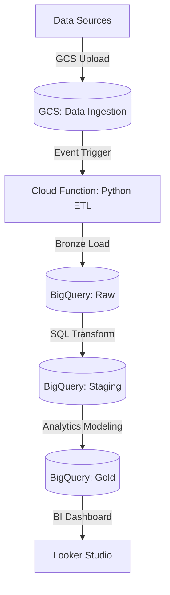

# GCP Data Platform Hub

**Data Engineering Portfolio - Part 2**

A decoupled, cloud-native data platform designed to centralize, process, and visualize multi-source data streams. This project demonstrates advanced capabilities in Cloud Architecture, Infrastructure as Code (IaC), and Medallion Data Warehousing.

---

## Architecture & Data Flow

This platform follows a modern ELT (Extract-Load-Transform) pattern using a Medallion Architecture (Bronze, Silver, Gold).

---

## Engineering Documentation

Strategic decisions and technical knowledge are documented following professional standards:

*   [**Architecture Decisions (ADRs)**](docs/adr/)
*   [**Infrastructure as Code (IaC)**](docs/architecture/infrastructure-low-level.md)

---

## Key Technical Pillars

*   **Automation (Terraform):** 100% of the infrastructure is provisioned via code, ensuring reproducibility.
*   **Security (Least Privilege):** Fine-grained IAM controls using dedicated Service Accounts for every component.
*   **Data Integrity:** Multi-layer validation using Pydantic and BigQuery schema enforcement.
*   **FinOps Ready:** Proactive budget alerting ($1 USD threshold) and resource labeling for cost tracking.

---

## Featured Projects

### GCP Data Platform Hub
*   **Domain:** Cloud Architecture, Analytics Engineering & Data Analyst Hub.
*   **The Solution:** A decoupled GCP Hub (BigQuery + Cloud Functions) managed via Terraform.
*   **Tech Stack:** GCP, Terraform, Python, BigQuery, Looker Studio.

### De-Crypto Pipeline
*   **Domain:** Robust ETL & Data Quality Engineering.
*   **The Solution:** A resilient ETL pipeline with strict Data Contracts (Pydantic) and Idempotent Persistence.
*   **Tech Stack:** Python, PostgreSQL, Docker, Tenacity, Pytest.

---

## Technical Stack

*   **Cloud:** Google Cloud Platform (GCP)
*   **IaC:** Terraform
*   **Languages:** Python 3.11, SQL
*   **Storage:** Cloud Storage, BigQuery
*   **Compute:** Cloud Functions
*   **Observability:** Cloud Monitoring & Logging

---
*Developed by Jose Cortes - Transitioning from De-Crypto Pipeline (Part 1) to Cloud-Scale Engineering.*
